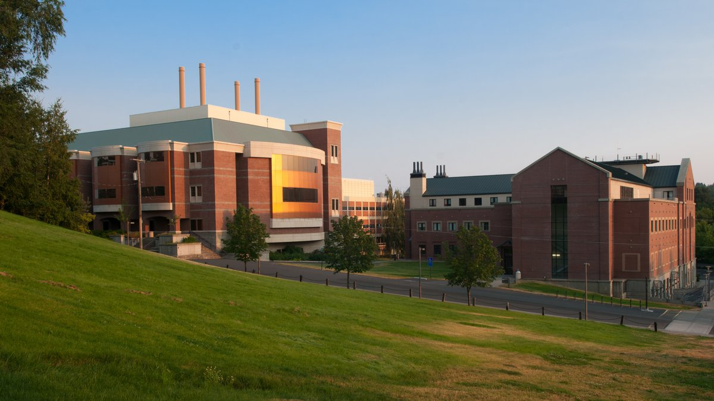

# The venue

The North American Einstein Toolkit School 2022 will be held at the <a
href="https://www.uidaho.edu/sci/physics">Department of Physics</a> of
the <a href="https://www.uidaho.edu">University of Idaho</a> in Moscow,
ID. The physics building is located right next to downtown Moscow, home
of many of the great restaurants our city has to offer. According to <a
href="https://www.walkscore.com/ID/">walkscore.com</a>, Moscow is rated
as the most walkable city in the state of Idaho!

 
<strong>Left:</strong> James A. McClure Hall. <strong>Right:</strong> Engineering & Physics Building.

Engineering & Physics Building
 
691 Ash Street
 
Moscow, ID, 83844, USA
 
<a href="tel:+12088856380">+1 (208) 885-6380</a>
 
<a href="https://goo.gl/maps/xV8GpXfB8fFo2FMt6">View location on Google maps</a>

We also encourage everyone to visit our amazing <a
href="https://visitmoscowid.com/eat-and-drink/restaurants/">restaurants</a>
and <a href="https://visitmoscowid.com/eat-and-drink/coffee-shops/">coffee
shops</a>! We highly recommend visiting our historic
<a href="https://visitmoscowid.com/see-and-do/farmers-market/">Farmer's Market</a>,
held on Main Street each Saturday, May through October, from 8 a.m. to 1
p.m. <a href="https://visitmoscowid.com/see-and-do/">Explore</a> all that our
city has to offer!

# COVID-19 guidelines

All of those who wish to attend the event in-person are strongly encouraged to
have been fully vaccinated for COVID-19. The event will be held in a room that
allows everyone to social distance.

<strong>As of March 14, 2022</strong>, the use of face masks is <u>optional</u>
in all university buildings on the Moscow campus. We will update this notice as
new guidelines become available.

# Traveling to Moscow, ID

There are two airports that serve the Moscow area. The
first—and recommended—airport is the <a
href="http://www.flypuw.com">Pullman-Moscow Regional Airport</a>,
located in Pullman, WA, just 7 miles away from downtown Moscow.

<iframe src="https://www.google.com/maps/embed?pb=!1m28!1m12!1m3!1d43742.71101940141!2d-117.09284651924095!3d46.746770622960916!2m3!1f0!2f0!3f0!3m2!1i1024!2i768!4f13.1!4m13!3e0!4m5!1s0x549f87c9fd811bf7%3A0x70b37b770a753b22!2sPullman-Moscow%20Regional%20Airport%2C%203200%20Airport%20Complex%20North%2C%20Pullman%2C%20WA%2099163!3m2!1d46.744357199999996!2d-117.11412709999999!4m5!1s0x54a0279c33f11ad1%3A0xed78e077b5f09bbe!2sS%20Main%20St%2C%20Moscow%2C%20ID%2083843!3m2!1d46.723141899999995!2d-117.0014248!5e0!3m2!1sen!2sus!4v1644906168608!5m2!1sen!2sus" width="400" height="300" style="border:0;" allowfullscreen="" loading="lazy"></iframe>

The second airport is the <a href="https://spokaneairports.net">Spokane
International Airport</a>, located in Spokane, WA, 83 miles from downtown
Moscow.

<iframe src="https://www.google.com/maps/embed?pb=!1m28!1m12!1m3!1d694130.4249222663!2d-117.74129834452323!3d47.188263390296314!2m3!1f0!2f0!3f0!3m2!1i1024!2i768!4f13.1!4m13!3e6!4m5!1s0x549e16254e306331%3A0x70cd8b086ddc8e08!2sspokane%20international%20airport!3m2!1d47.6212063!2d-117.5333721!4m5!1s0x54a0279c33f11ad1%3A0xed78e077b5f09bbe!2sS%20Main%20St%2C%20Moscow%2C%20ID%2083843!3m2!1d46.723141899999995!2d-117.0014248!5e0!3m2!1sen!2sus!4v1644906479971!5m2!1sen!2sus" width="400" height="300" style="border:0;" allowfullscreen="" loading="lazy"></iframe>

# Accommodation

## Fairfield Inn & Suites Moscow

This is the preferred hotel for the event, located just half a mile away
from the Engineering & Physics building. Special rates will apply to those who
book their rooms by <strong>June 1, 2022</strong> using <a href="https://www.marriott.com/event-reservations/reservation-link.mi?id=1647978841560&key=GRP&app=resvlink">this link</a>.

<iframe src="https://www.google.com/maps/embed?pb=!1m28!1m12!1m3!1d2734.6854490402184!2d-117.01395578431267!3d46.73166535599744!2m3!1f0!2f0!3f0!3m2!1i1024!2i768!4f13.1!4m13!3e2!4m5!1s0x54a0278090f1ff65%3A0x245d1725bc0c141b!2sFairfield%20Inn%20%26%20Suites%20by%20Marriott%20Moscow%2C%201000%20W%20Pullman%20Rd%2C%20Moscow%2C%20ID%2083843!3m2!1d46.7339139!2d-117.01410759999999!4m5!1s0x54a02786789997e3%3A0x14dbc079d02d50c4!2sUniversity%20of%20Idaho%20Department%20of%20Physics%2C%20691%20Ash%20St%2C%20Moscow%2C%20ID%2083844%2C%20United%20States!3m2!1d46.7293333!2d-117.00966489999999!5e0!3m2!1sen!2sus!4v1644907163377!5m2!1sen!2sus" width="400" height="300" style="border:0;" allowfullscreen="" loading="lazy"></iframe>
  
Fairfield Inn & Suites Moscow
 
1000 West Pullman Road
 
Moscow, ID, 83843, USA
 
<a href="tel:+12088824600">+1 (208) 882-4600</a>
 
<a href="https://www.marriott.com/hotels/travel/puwfi-fairfield-inn-and-suites-moscow/">Hotel website</a>
 
<a href="https://www.marriott.com/event-reservations/reservation-link.mi?id=1647978841560&key=GRP&app=resvlink">Click here to book your reservation</a>

## The Monarch Motel

This is the second hotel recommended by the event, also closely located to the
Engineering & Physics building.

<iframe src="https://www.google.com/maps/embed?pb=!1m28!1m12!1m3!1d2734.7762150444073!2d-117.00819163421848!3d46.729875256119236!2m3!1f0!2f0!3f0!3m2!1i1024!2i768!4f13.1!4m13!3e2!4m5!1s0x54a02778e787eaff%3A0xf3b95ed587c7e73!2sThe%20Monarch%20Motel%2C%20West%206th%20Street%2C%20Moscow%2C%20ID!3m2!1d46.730226599999995!2d-117.00231749999999!4m5!1s0x54a02786789997e3%3A0x14dbc079d02d50c4!2sUniversity%20of%20Idaho%20Department%20of%20Physics%2C%20691%20Ash%20St%2C%20Moscow%2C%20ID%2083844%2C%20United%20States!3m2!1d46.7293333!2d-117.00966489999999!5e0!3m2!1sen!2sus!4v1648840294677!5m2!1sen!2sus" width="400" height="300" style="border:0;" allowfullscreen="" loading="lazy" referrerpolicy="no-referrer-when-downgrade"></iframe>
  
The Monarch Motel
 
120 West 6th St
 
Moscow, ID, 83843, USA
 
<a href="tel:+12088822581">+1 (208) 882-2581</a>
 
<a href="https://moscowmonarch.com/">Hotel website</a>

## Parking

The city of Moscow, ID is extremely walkable and thus we strong encourage all participants to walk from their hotel to the Engineering & Physics Building. There is limited free parking on campus during the summer, on the so-called "Orange lots". If you plan on driving, please ensure you park your vehicle in the appropriate lot, as failing to do so may result in parking tickets and/or vehicle towing.

 

The map below shows the location of the orange parking lots, the Engineering & Physics Building, and the approximate location of the recommended hotels.

<iframe src="images/summer_break_parking_map.pdf" width="100%" height="500px"></iframe>

