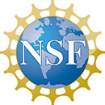



# North American Einstein Toolkit School 2022

<!--<wbr> allows browsers to break a line here -->

-------|--------------
Date:  | June 13th 2022 to June 17th 2022
Time:  | 8:25 AM PDT to 5:25 PM PDT
Registration & abstract submission deadline:  | May 1st 2022
Chat:  | [gitter.im/<wbr>EinsteinToolkit/<wbr>workshop](https://gitter.im/EinsteinToolkit/workshop)
Email: | [workshop@<wbr>einsteintoolkit.<wbr>org](mailto:workshop@einsteintoolkit.org)
Venue:&nbsp;  | University of Idaho, simulcast via YouTube or Zoom

The 2022 edition of the North American Einstein Toolkit Workshop will be
held at the University of Idaho. Both in-person and virtual attendees
are welcome to participate. The Workshop will provide an opportunity for
researchers and students to gather and learn about the
<a href="https://einsteintoolkit.org/">Einstein Toolkit</a>.

As the Einstein Toolkit provides a community-driven software platform of
computational tools to advance and support research in relativistic
astrophysics and gravitational physics, the Workshop will offer a
mixture of talks and tutorials for both new and advanced users. The
talks will highlight exciting science cases and the latest developments
in numerical relativity. On the final day, we will discuss future
directions and development.

This year, a special field trip will be offered on Wednesday, June 15 for
in-person participants to nearby LIGO Hanford, whose direct observation of the
gravitational waves from a coalescing pair of black holes led to the 2017 Nobel
Prize in Physics. During the visit, LIGO Hanford will be gearing up for the
start of O4 (Observing Run 4), due to start at the end of this year. On the same
day, virtual participants will have the opportunity to attend an Einstein
Toolkit hackathon.

## How to Attend

You may attend either in person or virtually.

**In-person**: The tabs above provide information on Travel, Accommodations, and Venue.

**Virtual**: Connection information will be emailed to you after you [register](register.html).

Recordings will be made available in a
[YouTube playlist](https://www.youtube.com/watch?v=dHOfYNqALys&list=PLRxi-yB7cTGfIPyQLSNulydOAPSPHN2Hc).

## Questions
If you have any questions, please contact the organizers at [workshop@einsteintoolkit.org](mailto:workshop@einsteintoolkit.org).

## Past Schools and Workshops
* 2021: [UIUC, virtual](https://einsteintoolkit.github.io/et2021uiuc/)
* 2020: [LSU, virtual](https://www.cct.lsu.edu/Einsteintoolkitworkshop)
* 2019: [London](https://sites.google.com/view/eetm2019/home)
* 2019: [RIT](https://ccrg.rit.edu/content/events/2019-06-17/north-american-einstein-toolkit-workshop-2019)

## Sponsored by
{: class="textwrapright" style='height: 4em' }
NSF [OAC-2004879](https://nsf.gov/awardsearch/showAward?AWD_ID=2004311&HistoricalAwards=false) "The Einstein Toolkit ecosystem: Enabling fundamental research in the era of multi-messenger astrophysics".

